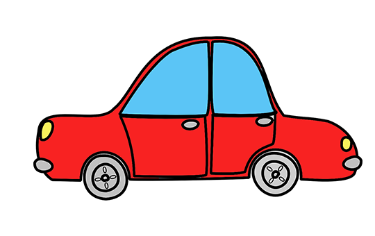

<!DOCTYPE html>
<html lang="fi">
<head>
  <meta charset="UTF-8" />
  <meta name="viewport" content="width=device-width, initial-scale=1.0"/>
 
  <link rel="stylesheet" href="../Resources/main.css"/>
  <link rel="stylesheet" href=""/>
  <link rel="preconnect" href="https://fonts.gstatic.com" crossorigin>
  <link href="https://fonts.googleapis.com/css2?family=Roboto+Condensed:ital,wght@0,100..900;1,100..900&family=Roboto+Serif:ital,opsz,wght@0,8..144,100..900;1,8..144,100..900&display=swap" rel="stylesheet">
 <title>Ajopäiväkirja</title>
 
</head>

<body>
    <header class="header">
        
Ajopäiväkirja

      
        <nav class="navbar">
          <ul class="nav-links">
            <li><a href="/">Koti</a></li>
            <li><a href="../Page2/tokasivu.html">Aloita matka</a></li>
            <li><a href="../Page3/kolmassivu.html">Ajohistoria</a></li>
            <li><a href="../Page4/neljassivu_kirjautuminen.html">Kirjaudu/Rekisteröidy</a></li>
          </ul>
          <button class="hamburger" id="hamburger">
            &#9776;
          </button>
        </nav>
      </header>
      
      <section class="cityline-section">
        
      </section>
  

<main class="hero">

  

    
    <button class="startTripBtn">Aloita matka</button>
  

  
</main>

  <footer>
    

      <a href="#">Tietosuojaseloste</a>
    

    
© Henri Hellsten

    

      <a href="#">Koti</a> | 
      <a href="#">Aloita matka</a> | 
      <a href="#">Ajohistoria</a> | 
      <a href="#">Kirjaudu</a>
    

  </footer>

   
   

</body>
</html>
